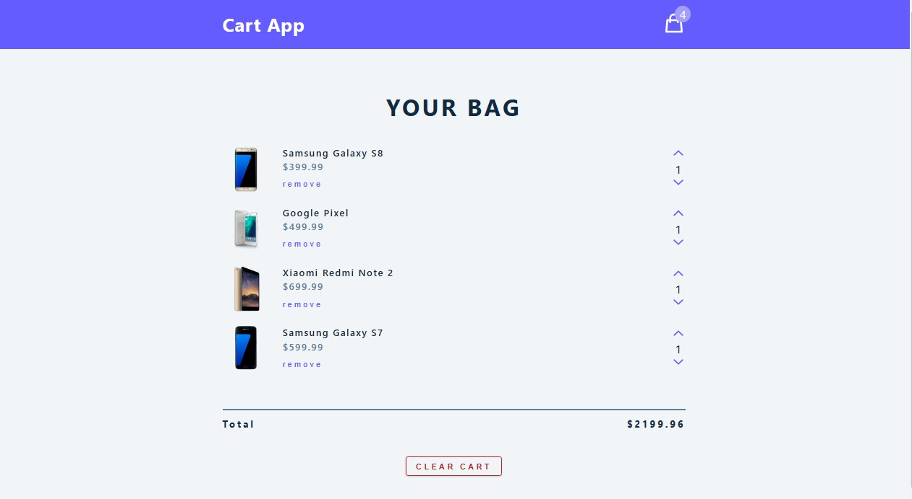

<a name="readme-top"></a>
<br />

<div align="center">
  <a href="https://github.com/eslamsobhy/redux-toolkit-cart-app">
    
  </a>

  <h1 align="center">Redux Toolkit Cart-app</h1>

  <p align="center">
    <a href="https://cart-app-rho.vercel.app/">View Demo</a>
  </p>
</div>

<!-- TABLE OF CONTENTS -->
<details>
  <summary>Table of Contents</summary>
  <ol>
    <li>
      <a href="#about-the-project">About The Project</a>
      <ul>
        <li><a href="#built-with">Built With</a></li>
      </ul>
    </li>
    <li>
      <a href="#getting-started">Getting Started</a>
      <ul>
        <li><a href="#prerequisites">Prerequisites</a></li>
        <li><a href="#installation">Installation</a></li>
      </ul>
    </li>
    <li><a href="#usage">Usage</a></li>
    <li><a href="#roadmap">Roadmap</a></li>
    <li><a href="#contributing">Contributing</a></li>
    <li><a href="#license">License</a></li>
    <li><a href="#contact">Contact</a></li>
    <li><a href="#acknowledgments">Acknowledgments</a></li>
  </ol>
</details>

<!-- ABOUT THE PROJECT -->

## About The Project

<div align="center"></div>
<br/>

Shopping Cart app is a single page application that is responsible for displaying all of your shopping
cart items with the ability to:

- Remove a specific item.
- Increase or decrease the amount of a specific item.
- Remove the whole cart.
- Live update of the whole cart amount and price.

I've built the same application with almost the same functionalities BUT used different tools:

- `Context API`.
- `useReducer Hook`.

You can check it out from here: <a href="https://github.com/eslamsobhy/cart-app">Shopping cart app</a>

<p align="right">(<a href="#readme-top">back to top</a>)</p><hr/>

### ⚡ Technologies

- 
- 
- [](https://www.javascript.com/)
- 

<p align="right">(<a href="#readme-top">back to top</a>)</p><hr/>

<!-- GETTING STARTED -->

## Getting Started

Here I'll guide you through all of the steps followed during implementing this app:

### Installation

- Install The Project with redux from the beginning:

```sh
npx create-react-app shopping-cart-app --template redux
```

- @latest

```sh
npx create-react-app@latest shopping-cart-app --template redux
```

#### OR:

- Install Redux to an existing project:

```sh
npm install @reduxjs/toolkit react-redux
```

#### @reduxjs/toolkit

consists of few libraries

- redux (core library, state management)
- immer (allows to mutate state)
- redux-thunk (handles async actions)
- reselect (simplifies reducer functions)

#### Extras

- redux devtools
- combine reducers

### Steps

1. Connecting our app to redux:

#### Setup Store:

```js
import { configureStore } from "@reduxjs/toolkit";

export const store = configureStore({
  reducer: {},
});
```

#### Setup Provider:

```js
import React from "react";
import ReactDOM from "react-dom";
import "./index.css";
import App from "./App";
// import store and provider
import { store } from "./store";
import { Provider } from "react-redux";

ReactDOM.render(
  <React.StrictMode>
    <Provider store={store}>
      <App />
    </Provider>
  </React.StrictMode>,
  document.getElementById("root")
);
```

- <p align="left">(<a href="https://github.com/eslamsobhy/redux-toolkit-cart-app/commit/00105435f59d449bc7220396d033d5d2458c6f9e" target="_blank">visit source code</a>)</p><hr/>

2. Setup the Cart Slice:

- application feature
- create features folder/cart
- create cartSlice.js

#### Create The Slice:

```js
import { createSlice } from "@reduxjs/toolkit";

const initialState = {
  cartItems: [],
  amount: 0,
  total: 0,
  isLoading: true,
};

const cartSlice = createSlice({
  name: "cart",
  initialState,
});

console.log(cartSlice);

export default cartSlice.reducer;
```

#### Link It To The Store:

```js
import { configureStore } from "@reduxjs/toolkit";
import cartReducer from "./features/cart/cartSlice";

export const store = configureStore({
  reducer: {
    cart: cartReducer,
  },
});
```

- <p align="left">(<a href="https://github.com/eslamsobhy/redux-toolkit-cart-app/commit/79c311137d1647b9f6223050c5c926e75618c6e8" target="_blank">visit source code</a>)</p><hr/>

3. Access The Store Value Using useSelector Hook:

#### Getting The Amount from the store:

```js
import { CartIcon } from "../icons";
import { useSelector } from "react-redux";

const Navbar = () => {
  const { amount } = useSelector((state) => state.cart); // state is holding the whole app state

  return (
    <nav>
      <div className="nav-center">
        <h3>redux toolkit</h3>
        <div className="nav-container">
          <CartIcon />
          <div className="amount-container">
            <p className="total-amount">{amount}</p>
          </div>
        </div>
      </div>
    </nav>
  );
};
export default Navbar;
```

- <p align="left">(<a href="https://github.com/eslamsobhy/redux-toolkit-cart-app/commit/5d8e1dc0f21b8df3dcc67a51a4c9042c268b2168" target="_blank">visit source code</a>)</p><hr/>

4. Setup The Cart:

#### Cart Container & Cart Item Rendered:

- <p align="left">(<a href="https://github.com/eslamsobhy/redux-toolkit-cart-app/commit/13c78d7cf3dc3b74b9ad3a877ee6b0ea2bb00c94" target="_blank">visit source code</a>) For Rendering The List</p>
- <p align="left">(<a href="https://github.com/eslamsobhy/redux-toolkit-cart-app/commit/a754c13d69ec09fbab7824c4951fceab5a630801" target="_blank">visit source code</a>) For Rendering The CartItem</p><hr/>

5. Implementing Functionalities (Reducers):

#### Clearing The Whole Cart:

- Adding the reducer:

```js
const cartSlice = createSlice({
  name: "cart",
  initialState,
  reducers: {
    clearCart: (state) => {
      state.cartItems = [];
    },
  },
});

export const { clearCart } = cartSlice.actions;
```

- Dispatching the action:

```js
import React from "react";
import CartItem from "./CartItem";
import { useDispatch, useSelector } from "react-redux";

const CartContainer = () => {
  const dispatch = useDispatch();

  return (
    <button
      className="btn clear-btn"
      onClick={() => {
        dispatch(clearCart());
      }}
    >
      clear cart
    </button>
  );
};

export default CartContainer;
```

- <p align="left">(<a href="https://github.com/eslamsobhy/redux-toolkit-cart-app/commit/d213dfff5f59047d4bd2e1b2fda47c826121d2e4" target="_blank">visit source code</a>)</p>

#### Removing One Cart Item, Increasing, Decreasing, Getting Totals:

- Adding the reducers:

```js
import { createSlice } from "@reduxjs/toolkit";
import cartItems from "../../cartItems";

const initialState = {
  cartItems: [],
  amount: 0,
  total: 0,
  isLoading: true,
};

const cartSlice = createSlice({
  name: "cart",
  initialState,
  reducers: {
    clearCart: (state) => {
      state.cartItems = [];
    },
    removeItem: (state, action) => {
      const itemId = action.payload;
      state.cartItems = state.cartItems.filter((item) => item.id !== itemId);
    },
    increase: (state, { payload }) => {
      const cartItem = state.cartItems.find((item) => item.id === payload.id);
      cartItem.amount = cartItem.amount + 1;
    },
    decrease: (state, { payload }) => {
      const cartItem = state.cartItems.find((item) => item.id === payload.id);
      cartItem.amount = cartItem.amount - 1;
    },
    calculateTotals: (state) => {
      let amount = 0;
      let total = 0;
      state.cartItems.forEach((item) => {
        amount += item.amount;
        total += item.amount * item.price;
      });
      state.amount = amount;
      state.total = total;
    },
  },
});

export const { clearCart, removeItem, increase, decrease, calculateTotals } =
  cartSlice.actions;

export default cartSlice.reducer;
```

- Dispatching them (CartItem.js):

```js
import React from "react";
import { ChevronDown, ChevronUp } from "../icons";

import { useDispatch } from "react-redux";
import { removeItem, increase, decrease } from "../features/cart/cartSlice";

const CartItem = ({ id, img, title, price, amount }) => {
  const dispatch = useDispatch();

  return (
    <article className="cart-item">
      
      <div>
        <h4>{title}</h4>
        <h4 className="item-price">${price}</h4>
        {/* remove button */}
        <button
          className="remove-btn"
          onClick={() => {
            dispatch(removeItem(id));
          }}
        >
          remove
        </button>
      </div>
      <div>
        {/* increase amount */}
        <button
          className="amount-btn"
          onClick={() => {
            dispatch(increase({ id }));
          }}
        >
          <ChevronUp />
        </button>
        {/* amount */}
        <p className="amount">{amount}</p>
        {/* decrease amount */}
        <button
          className="amount-btn"
          onClick={() => {
            if (amount === 1) {
              dispatch(removeItem(id));
              return;
            }
            dispatch(decrease({ id }));
          }}
        >
          <ChevronDown />
        </button>
      </div>
    </article>
  );
};

export default CartItem;
```

- Dispatching them (App.js):

```js
import { useEffect } from "react";
import Navbar from "./components/Navbar";
import CartContainer from "./components/CartContainer";
import { useSelector, useDispatch } from "react-redux";
import { calculateTotals } from "./features/cart/cartSlice";

function App() {
  const { cartItems } = useSelector((state) => state.cart);
  const dispatch = useDispatch();
  useEffect(() => {
    dispatch(calculateTotals());
  }, [cartItems]);

  return (
    <main>
      <Navbar />
      <CartContainer />
    </main>
  );
}

export default App;
```

- <p align="left">(<a href="https://github.com/eslamsobhy/redux-toolkit-cart-app/commit/e9667ce6ed873c48520b25da0fcf13630c822b07" target="_blank">visit source code</a>)</p><hr/>

<p align="right">(<a href="#readme-top">back to top</a>)</p><hr/>
```
